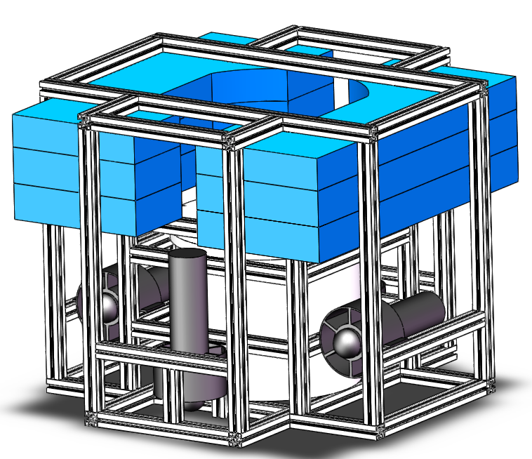
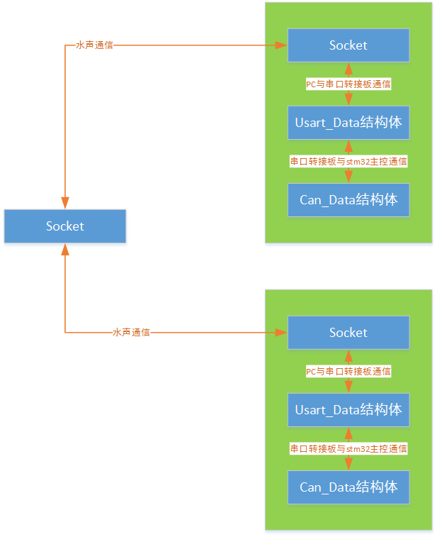
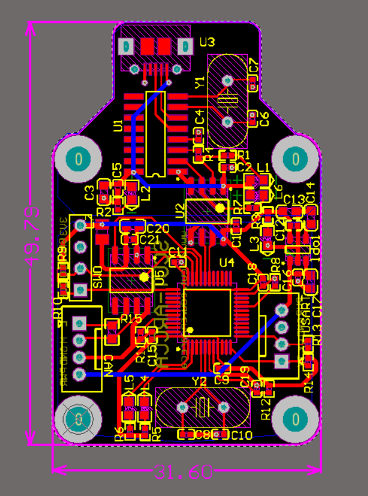
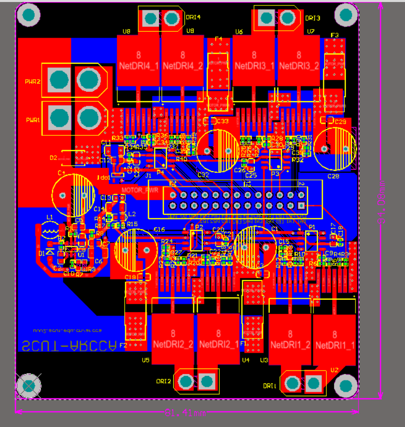
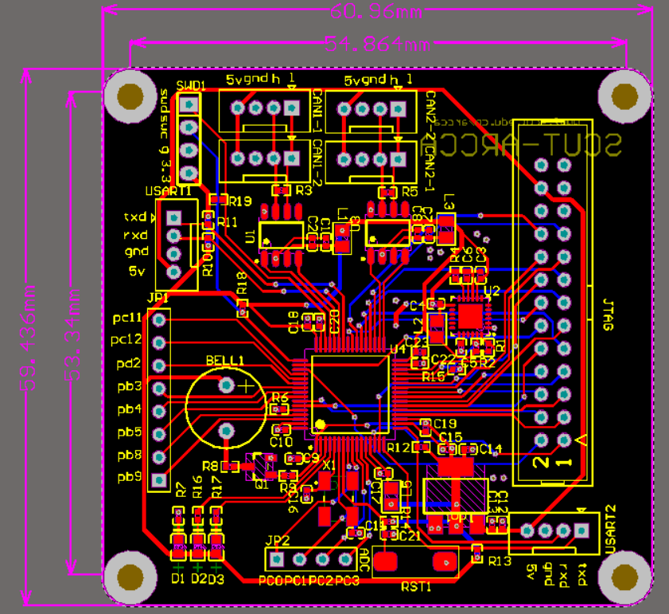

# Underwater-Acoustic-Communication-System
历时将近一年的srp项目：水声通信系统，硬件包括潜水器框架、迷你PC和STM32主控板等，软件包括RTX 、CAN、Socket等，现整理并复习项目知识

### 总述
项目的目标是建立一个提供在水下自由平稳移动的水下测试平台。岸上使用自主设计的上位机控制工作状态，舱内搭载的是水下通信节点和换能器、Mini计算机、STM32主控板等硬件设施，采用的通信方式包括水声通信、Socket通信、UART通信、CAN通信。在岸上PC的控制下，一方面将岸上的人为控制信息传到水声节点，再分发给各潜水器，其中人为控制信息包括遥控器信号、ip地址、组网状态等；另一方面，岸上PC接收潜水器传回的数据，包括姿态信息、采集的外部信息等。除采集作业之外，岸上PC和多台水下PC之间能够使用时分多址方式或者随即接入方式搭建网络，进一步拓展水下无线通信的范围以及为拓展作业奠定基础。

潜水器的机械结构如下：



水声通信的总体架构如下：


程序数据流图如下：



整个团队包括多名来自电信学院和机汽学院学生，而本人负责的部分有遥控数据处理，Uart2Can转换板，电机驱动板、stm32主控，接着主要总结负责的部分。

### 遥控器
使用stm32的adc功能接口依次采集手柄的5种电压数据，转换为控制数据即打包成NRF_PowerData_TypeDef结构体，通过Uart协议发送给PC

数据包结构体定义：
``` C
//数据包格式:共凑足64位
//偏航角，就是在平面旋转；翻滚角；水中深度；前进
typedef struct
{
	uint16_t delta_yaw; 
	uint16_t roll;	
	uint16_t heigth_power;  
	uint16_t go_ahead_power:12;
	uint16_t Left_Key:2;
	uint16_t right_Key:2;
}NRF_PowerData_TypeDef;//传输的数据结构体

```
adc数据处理：均值滤波、死区处理
``` C
void ADC_Convert(NRF_PowerData_TypeDef*Nrf_Data)
{
	uint8_t i;
	uint32_t front_power=0;	//控制前的油门
	uint32_t left_right_power=0;	//控制左右的油门
	uint32_t rotate_power=0;			//控制旋转的油门
	uint32_t throttle_power=0;		//控制高低的油门

	for(i=0;i<Initial_len/5;i++)	
		{
			front_power+= ADC_InitialValue[Left_x+i*5]; 
			left_right_power+= ADC_InitialValue[Left_y+i*5]; 
			throttle_power+= ADC_InitialValue[Right_x+i*5];  
			rotate_power+= ADC_InitialValue[Right_y+i*5];				
			Power_Voltage+=(float) ADC_InitialValue[4+i*5]*2/4096*3.3; //Power_Voltage，由于分压故乘2才是真实电压
		}
	Power_Voltage /=(Initial_len/5);
	front_power/=(Initial_len/5);
	left_right_power/=(Initial_len/5);
	throttle_power/=(Initial_len/5);
	rotate_power/=	(Initial_len/5);
	throttle_power=4096-throttle_power;
	front_power=4096-front_power;
	//合法性检测
	if(front_power<320)
		front_power=320;
	
	front_power-=320;
	//死区内
	if(left_right_power>1900&&left_right_power<2196)
		left_right_power=2048;
	if(throttle_power>1900&&throttle_power<2196)
		throttle_power=2048;
	if(rotate_power>1900&&rotate_power<2196)
		rotate_power=2048;
	//死区外
	if(left_right_power>2196)
		left_right_power-=148;
	else if(left_right_power<1900)
		left_right_power+=148;
	
	if(throttle_power>2196)
		throttle_power-=148;
	else if(throttle_power<1900)
		throttle_power+=148;
	
	if(rotate_power>2196)
		rotate_power-=148;
	else if(rotate_power<1900)
		rotate_power+=148;
			
	Nrf_Data->delta_yaw=rotate_power;
	Nrf_Data->go_ahead_power=front_power;
	Nrf_Data->heigth_power=throttle_power;
	Nrf_Data->roll=left_right_power;
}
```

通过uart发送给PC：
```C
__task void AppTaskADC(void)
{
	NRF_PowerData_TypeDef Nrf_Send;
    while(1)
    {
		ADC_Convert(&Nrf_Send);
		
		Nrf_Send.Left_Key=(KEY1 ? 1 : 0);
		Nrf_Send.right_Key=(KEY1 ? 1 : 0);
		//串口发送数据
		if(Nrf_Send.Left_Key && Nrf_Send.right_Key){//两个按键同时往下拨才会发送数据
			os_mut_wait (mutex1, 0xffff);
  		printf("%lld\n",*((uint64_t *)&Nrf_Send));//直以64位发给PC
			os_mut_release (mutex1);	
		}
		os_dly_wait(500);
    }
}
```
### Uart2Can转换板
整个通信框架常用Uart和Can两种协议，设计Uart2Can转换板及编写其代码，方便拓展硬件范围。

PCB图如下：



uart与can互相转换的代码：要熟悉can报文的设置，包括ID与滤波掩码、波特率
```C
/* Usart2CAN：接收上位机发来的消息，利用pMsg指向消息地址，并且传递给CAN数据包*/
__task void Usart2CAN(void)//通过CAN把NRF的数据转发下去
{
	uint8_t *pMsg;//定义一个指针，用于指向邮箱
	Usart_PowerData_TypeDef* Usart_PowerData;
	CanTxMsg tx_message;
	u8 mbox;
	uint16_t i=0,j;
	/*CAN通信报文内容设置，需要清楚CAN协议数据帧报文格式*/
   	tx_message.DLC = 8;          //数据长度为8字节，最多为8个字节
	tx_message.StdId = SndCanID;    // 标准标识符  0 到0x7FF
   	tx_message.ExtId = 0x1314;    // 设置扩展标示符 0 到0x3FFFF
   	tx_message.IDE = CAN_ID_STD;    //IDE 消息标识符的类型 CAN_ID_STD  使用标准标识符 CAN_ID_EXT  标准标识符 + 扩展标识符
  	tx_message.RTR = CAN_RTR_DATA;  //数据帧
	while(1)
	{	
		if(Usart_receive(1,(void **)&pMsg,10000) != OS_R_TMO)
		{
			for(j=0;j<8;j++)
				tx_message.Data[j] = pMsg[j+1];//0x00;//  	//从[1]开始的原因是串口中断有处理，添加cnt在[0]
			pMsg=&tx_message.Data[0];
			os_mut_wait (&u1_mutex, 0xffff);
			mbox= CAN_Transmit(CAN1, &tx_message);		 
			/* CAN cell did not provide an empty mailbox即无法发送*/
			i = 0;
			while((CAN_TransmitStatus(CAN1, mbox)!= CAN_TxStatus_Ok)&&(i<0xffff))
			{
				i++;
				bsp_LedOn(1);
			}
		}
		os_dly_wait(250);
	}
}

/* CAN_Receive：接收CAN消息，使用CanRxMsg指针msg_rece */
__task void CAN_Receive(void)
{
	CanRxMsg *msg_rece;
	can_filter_Mask_config(CanFilter_0|CanFifo_0|Can_STDID|Can_DataType,RecvCanID,0x3ff);//配置CAN的筛选器
	can_nvic_config(CAN1_R0);//配置CAN的中断：此处为接收FIFO0中断
    while(1)
   {
        if (CAN_receive (1, 0,&msg_rece,1000) != OS_R_TMO)//接收到CAN数据
			{
				/************CAN 查询帧处**********/
				if(msg_rece->StdId ==	RecvCanID //本机ID为0x1314
				{
					os_mut_wait (&u1_mutex, 0xffff;
					printf("Can Recev :%d\r\n"msg_rece->Data[0]);
					os_mut_release (&u1_mutex);
				}
			}
		os_dly_wait(100);
    }
}
```

### 电机驱动板
主控生成PWM信号驱动能力过弱，需要通过驱动板放大来控制电机。

PCB图如下：



### stm32主控
stm32主控衔接迷你PC和电机等嵌入式模块，即外围设备的核心，负责驱动电机、检测漏水、获取腔体姿态等工作

PCB图如下：



主控代码：我的工作较少，只展示接收can数据帧，转换为控制电机的部分

```C
/**
 * [CAN1_Rec CAN1数据的处理]
 */

__task void CAN1_Rec(void)
{
	Power_TypeDef Power;
	NRF_PowerData_TypeDef* NRF_Data_P;
	CanRxMsg *msg_rece ;//指向邮箱中的信息
	can_filter_Mask_config(CanFilter_0|CanFifo_0|Can_STDID|Can_DataType,RecvCanID,0x3ff);//筛选器:|编号|FIFOx|ID类型|帧类型|ID|屏蔽位(0x3ff,0x1FFFFFFF)|
	while(1)
 	{
		if (CAN_receive (1, 0,&msg_rece,200) != OS_R_TMO)//接收到CAN数据
		{
			if(msg_rece->StdId == RecvCanID)
			{
				
				NRF_Data_P=(NRF_PowerData_TypeDef*)&msg_rece->Data[0];
				//左右
				Power.delta_yaw=((float)NRF_Data_P->delta_yaw-2048);//-2048--+2048
				//翻滚，实际中不怎么用到
				Power.roll=((float)NRF_Data_P->roll-2048);//-2048--+2048
				//高低
				Power.heigth_power=((float)NRF_Data_P->heigth_power-2048);//-2048--+2048
				//前进
				Power.go_ahead_power=(float)NRF_Data_P->go_ahead_power;
				Power.sw_left=(float)NRF_Data_P->Left_Key;
				Power.sw_right=(float)NRF_Data_P->right_Key;

				//潜水器深度+翻滚
				motor_dirver(Normal,3,Power.heigth_power+Power.roll);
				motor_dirver(Normal,4,Power.heigth_power-Power.roll);
				//潜水器前进+偏航
				motor_dirver(Normal,2,Power.go_ahead_power+Power.delta_yaw);
				motor_dirver(Normal,1,Power.go_ahead_power-Power.delta_yaw);				

						
				os_evt_set(BIT_0,HandleDisconnectCheck);//设置HandleDisconnectCheck的标志位，HandleDisconnectCheck由挂起转到运行
				
				os_mut_wait (&mutex_u1, 0xffff);
				printf("Can Recev :%d\r\n",msg_rece->Data[0]);
				os_mut_release (&mutex_u1);	
			 }
		}
	}
}
```

### RTX小结
[RTX操作系统简介](http://songliu2003.blog.163.com/blog/static/2958226420080129139249/ "RTX操作系统简介")

任务管理、任务创建和删除、任务挂起和恢复、时间片轮转调度、系统内部任务（包括钩子函数）、中断和时间管理、软件定时器。事件标志组用于同步，信号量用于共享资源。

### CAN配置
[CAN基础](https://wenku.baidu.com/view/d2b7d79919e8b8f67c1cb9a1.html "CAN基础")：相当于网络协议的物理层+数据链路层+应用层，是有检测信道的

[CAN ID滤波器分析](http://blog.csdn.net/flydream0/article/details/8148791 "CAN ID滤波器分析")：can通讯速率，是高速还是低速；帧都是支持的can2.0A/B吗？帧格式是否一致；过滤原则有没有问题等最好检查一下

### PCB制板
Uart2CAN：

电容放置、差分线平行且相等、分模块设计，直线原则、先考虑VCC再连接元件最后覆铜过孔到地、指针找元件等快捷键

Driver：

使用矩形板画粗线、稳压二极管负极接高电平、放置大量过孔的技巧是将网格放大

工厂制板：

使用嘉立创SMT贴片，选封装时，在官网[可贴片元器件列表](http://www.sz-jlc.com/consumer/index.do?s=1502706529422)查询是否有对应的SMT贴片元件，如果没有只能买元件焊，这时候画PCB时多留点空间；如果有，则把元件画得紧凑些。